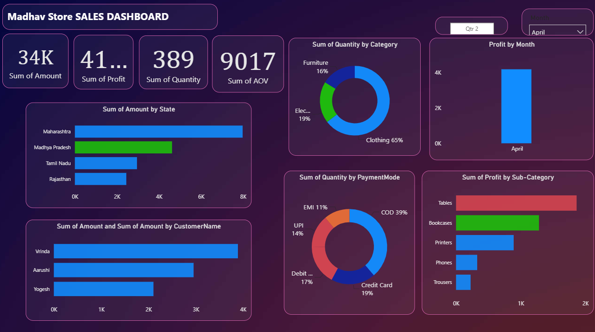

 Madhav Store Sales Dashboard

 Overview
The **Madhav Store Sales Dashboard** is an interactive Power BI project designed to analyze and monitor the sales performance of an e-commerce business across India. The dashboard provides insights into sales, profit, customer behavior, product categories, payment methods, and regional performance to support data-driven decision-making.

 Objective
Develop an interactive Power BI dashboard to track and analyze Madhav Store's online sales across India.

 Tools & Technologies
- Power BI
- DAX (Data Analysis Expressions)
- Microsoft Excel (CSV)
- Data Cleaning
- Data Visualization

 Dataset
- Orders.csv
- Dataset.csv

 Dashboard Features
- Total Sales Amount
- Total Profit
- Total Quantity Sold
- Average Order Value (AOV)
- Sales by State
- Sales by Customer
- Category-wise Sales Analysis
- Payment Mode Analysis
- Monthly Profit Analysis
- Profit by Sub-Category
- Interactive Filters (Quarter & Month)

 Dashboard Preview

Key Insights
- Maharashtra recorded the highest sales.
- Clothing contributed the highest sales.
- Cash on Delivery (COD) was the most preferred payment method.
- Tables and Bookcases generated the highest profit.
- The dashboard enables quick business performance analysis using interactive visualizations.

 Repository Contents
- `Madhav_Store_Dashboard.pbix` – Power BI Dashboard
- `Orders.csv` – Orders Dataset
- `Dataset.csv` – Sales Dataset
- `Dashboard.png` – Dashboard Screenshot

 Future Improvements
- Add year-wise sales comparison.
- Build customer segmentation analysis.
- Create sales forecasting using Power BI.
- Connect the dashboard to a live database.

Author
Richa Mishra
